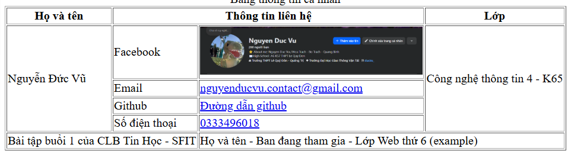

***Bài tập buổi 1:*** Tạo 1 trang web cơ bản, bao gồm, các nội dung sau:
1. trong thẻ head tạo các thẻ meta mô tả nội dung trang là Họ và tên - Mã sinh viên - Lớp, thẻ meta robot, thẻ meta author (là tên của mình)
2. dùng thẻ h1 - để tiêu đề trang là tên của mình + thẻ h2 để lớp của mình
3. paste đoạn văn sau vào thẻ p: *"Lorem ipsum dolor sit amet consectetur adipisicing elit. Asperiores similique debitis illum fugit deleniti magnam quas ipsam dolores voluptatem distinctio maiores repellendus incidunt, dignissimos ad hic nam recusandae nostrum voluptas."*
4. Tạo 1 table có cấu trúc như sau:
